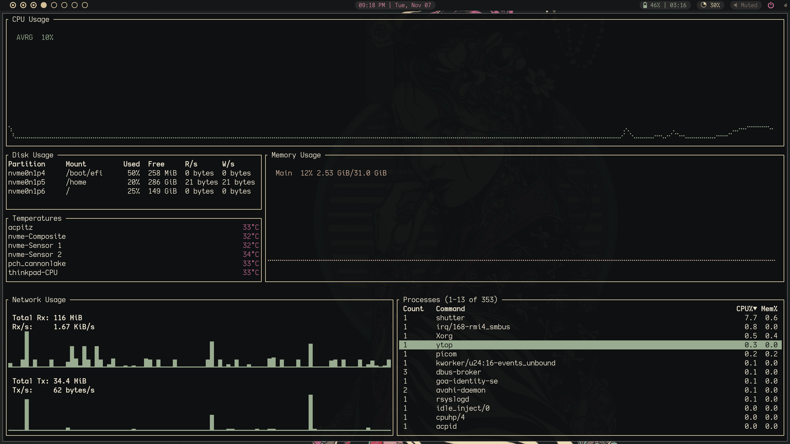
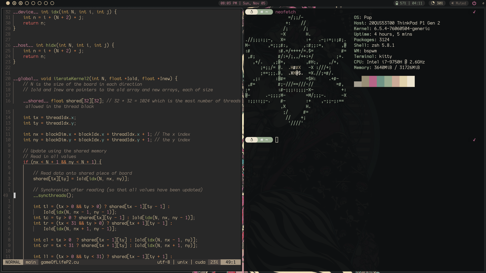

# dotfiles
My essential configuration files and scripts 
(should be mostly distro agnostic)

## Installation Instructions
1. clone directory to home folder  
2. ```cd ~/dotfiles```  
3. run ```scripts/setup.sh``` which will create backups and symlinks  

## Dependencies
- zsh
- bspwm
- sxhkd
- neovim 0.7.x+
- rofi
- picom
- polybar
- kitty
- pywal

## Screenshots






